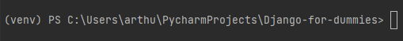
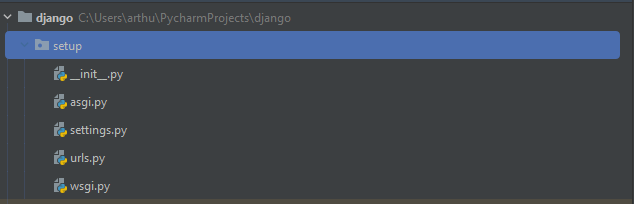
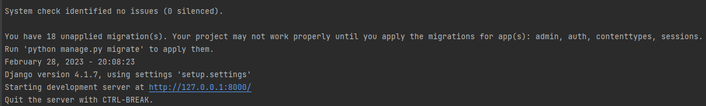
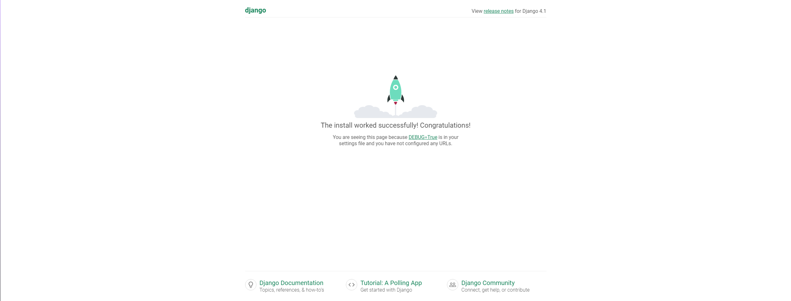

# Sobre Django

* Django é um framework full-stack escrito em Python, ou seja, uma ferramenta com uma biblioteca extensa com funções fundamentais para criação de aplicativos web.

* Sites como Instagram, Spotfy, Youtube, DropBox, Pinterest, Mozilla... Foram feitos ou tiveram contato com Django.

## Como instalar Django

Primeiramente, crie um arquivo vazio, e em seguida instale uma máquina virtual, para que o Django não fique para sempre no Python e sim temporariamente. Agora, para instalar a máquina, acesse o vídeo que ensina como que faz:

### https://www.youtube.com/watch?v=m1TYpvIYm74

#### Com a máquina instalada, abra o terminal localizado no arquivo, e com o nome da máquina virtual:

#### Próximo passo é a instalação do framework por um comando:

Terminal:
~~~terminal
pip install django
~~~

#### Instalação realizada, pode dar vida ao seu primeiro projeto:

Terminal:
~~~terminal
django-admin startproject setup .
~~~

#### Criando o novo projeto, você irá se deparar com uma pasta contendo arquivos diferentes:

#### Não se assuste pela quantia! Pois, com passar do tempo conhecerá individualmente a maioria deles!

#### Dito isso, você pode testar o seu site no ar. No terminal, digite:

Terminal:
~~~terminal
python manage.py runserver
~~~

#### Através desse comando, vai ser exibido um link com o seu IP, clicando, vai se deparar com a janela do seu primeiro site!

# Primeiro site criado!
