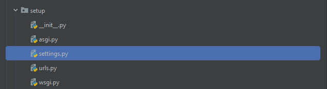
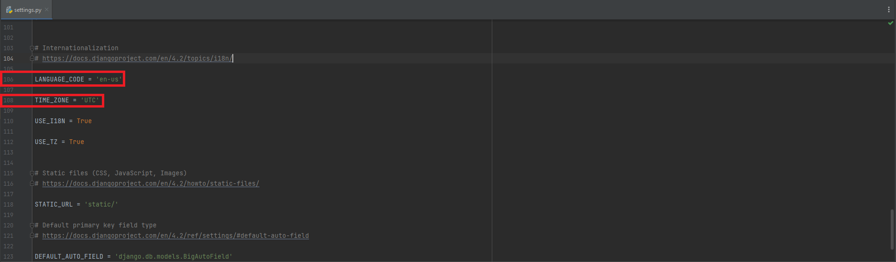
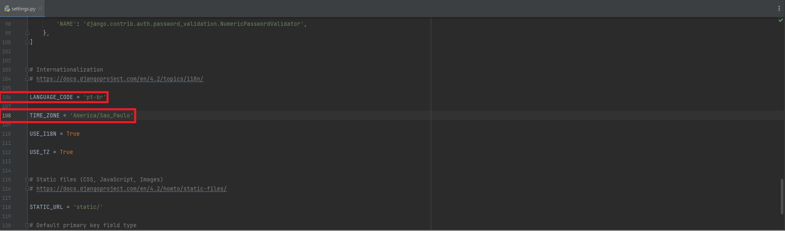
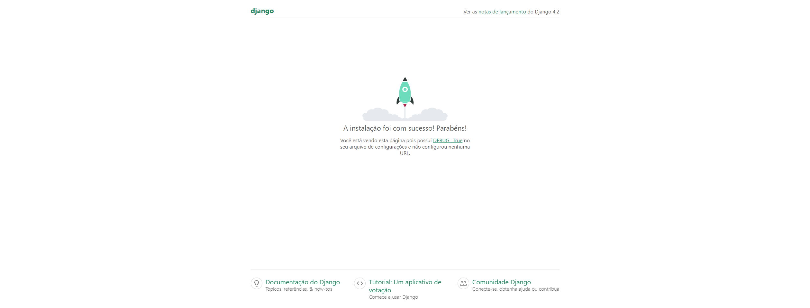
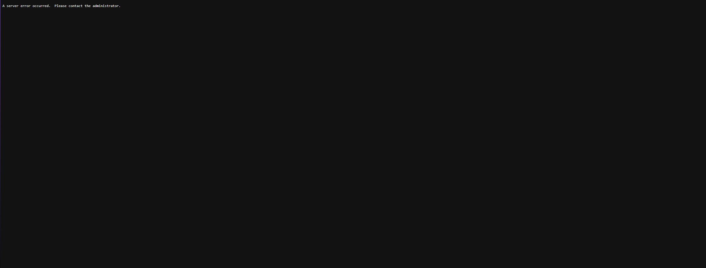

# Configurações, Git e GitHub
***
## Idioma e Timezone

#### Quando um projeto Django é criado, por padrão, ele é setado com a língua inglesa e uma Timezone UTC. Para poder acesar e manipular essas informações, na pasta 'setup', e em 'settings.py', aparecerá essas informações na linha 106 e 108.

#### Com as variáveis localizadas, altera-se os seus valores, ficando:

### Como o site fica após as alterações:

***

## Variáveis de ambiente

#### Todo projeto Django possui uma 'SECRET_KEY', que como o nome sugere, é um elemento secreto, onde a sua principal função é dar funcionamento ao site. Entretanto, se ao commitar e 'pushar' o projeto, pode ocorrer o risco de alguém remover a chave secreta, impedindo o seu funcionamento:

