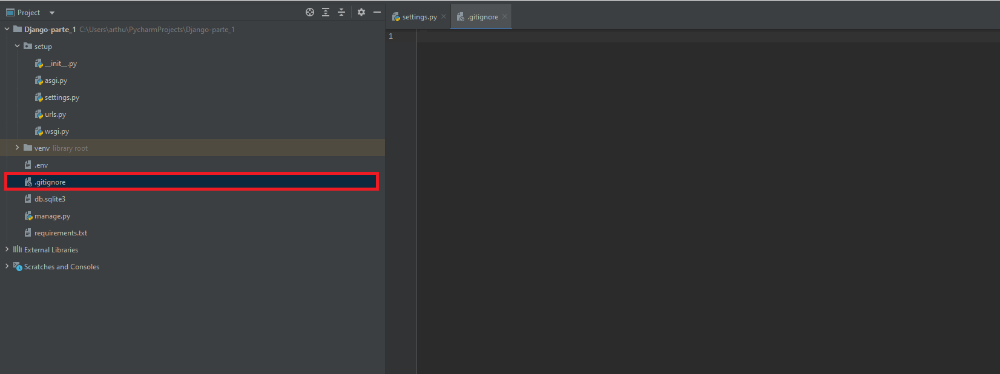

# Configurações, Git e GitHub
***
## Idioma e Timezone

#### Quando um projeto Django é criado, por padrão, ele é setado com a língua inglesa e uma Timezone UTC. Para poder acesar e manipular essas informações, na pasta 'setup', e em 'settings.py', aparecerá essas informações na linha 106 e 108.

#### Com as variáveis localizadas, altera-se os seus valores, ficando:

### Como o site fica após as alterações:

***

## Variáveis de ambiente

#### Todo projeto Django possui uma 'SECRET_KEY', que como o nome sugere, é um elemento secreto, onde a sua principal função é dar funcionamento ao site. Entretanto, se ao commitar e 'pushar' o projeto, pode ocorrer o risco de alguém remover a chave secreta, impedindo o seu funcionamento:

#### Por padrão, as SECRET_KEYS estão na linha 23 dentro de 'settings.py', sendo atribuidas a um valor criptografado:

#### Uma das maneiras de lidar com esse problema, é instalando a biblioteca python-dotenv:

~~~terminal
pip install python-dotenv
~~~

#### LEMBRANDO: para se certificar de que a biblioteca está instalada e faz parte dos requisitos do seu projeto, no terminal, escreva:
~~~terminal
pip freeze > requirements.txt
~~~

#### Isso vai fazer com que seja criado um arquivo de texto mostrando todos os requisitos do seu web aplicativo:

#### Com a instalação do Python-Dotenv, o próximo passo é tirar o valor da SECRET_KEY, criar um arquivo no diretório global (fora da pasta Setup) com o nome '.env', e criar uma variável com o mesmo nome e valor original, porém sem as aspas:

#### Feito isso, no settings.py, precisa-se importar 'load_dotenv' de dotenv, chama-se função do mesmo nome, e por fim, obtenha o valor da SECRET_KEY por uma função e converta em String:

***
### Git e Github

#### Tendo o projeto ou uma das etapas do projeto concluída, deverá exportar todo o trabalho no GitHub, entretanto é fortemente recomendado usar gitignore para não lidar com problemas envolvendo segurança, upload desnecessário e entre outros... 
#### Dito isso, é preciso criar um arquivo no diretório global com o nome '.gitignore', em seguida, visite o site [gititgnore.io](https://www.toptal.com/developers/gitignore/) e pesquise por Django no input do site, em seguida dê *CTRL A* e copia todo o código selecionado. Por fim, insira todo o código no arquivo criado e o projeto estará pronto para ser enviado:

***
## [Resolução da parte 1](https://github.com/ArthurOReis/Django-parte_1)