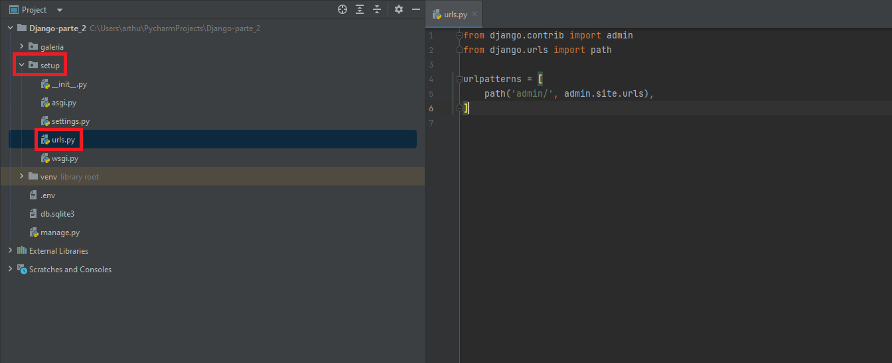

# Projeto, app e views
***
## App e projeto

#### Com o setup inicializado, é possível criar aplicativos dentro, que podem ser responsáveis por várias coisas, como criar janelas, podem-se conectar a banco de dados e/ou APIs.

#### Dito isso, para criar um app, precisa-se declarar no terminal, no diretório do projeto Django:

~~~terminal
python manage.py startapp galeria
~~~

#### Ao executar, é criado um diretório:

#### Em "_setup/settings.py_", próximo da linha 36, há uma lista de apps criados, e dentro deve-se inserir o novo aplicativo:

***
## Views e URLs

#### Com o novo app, é possível atender a requisições HTTP e criar uma interface, para fazer essas ações, acessando "_galeria/views.py_', arquivo responsável por renderizar o que vai ser exibido em cada página:

#### Uma das formas de mudar isso, é importando o método 'HttpResponse' da biblioteca do Django:
~~~python
from django.shortcuts import render
from django.http import HttpResponse

def index(request): #Função responsável por retornar algo, quando for pedido uma requisião
    return HttpResponse('<h1>Galeria!</h1>')
~~~
#### Rodando o projeto, não vai ser exibido a função, pois não há uma rota vinculando a função 'index', dito isso, para poder conectar, é preciso sair do repositório 'galeria' e acessar '_setup/urls.py_'

#### Nota-se 'urlpatterns', sendo uma lista de possíveis rotas que podem ser acessadas na aplicação, dito isso, criando um caminho vinculado com o index, ficaria:
~~~python
from django.contrib import admin
from django.urls import path
from galeria.views import index #Do arquivo views, importar método index

urlpatterns = [
    path('admin/', admin.site.urls),
    path('', index),
]
~~~
#### Agora, executando o projeto novamente, o resultado é:

***

## Isolando as URLs

#### Vincular um URL com um método HTTP foi fácil, porém ficar a repetir não é prático, inclusive, caso novos aplicativos surgirem, será mais difícil de realizar o procedimento manualmente. Para solucionar, primeiramente é preciso isolar as URLs da galeria, criando um arquivo no diretório da galeria, nomeado 'urls.py', em seguida, refatorar o código de 'setup/urls.py', para incluir todos os caminhos possíveis dentro, e por fim, em 'galeria/urls.py', setar para o arquivo gerenciar as rotas do aplicativo, ficando:

###### setup/urls.py
~~~python
from django.contrib import admin
from django.urls import path, include

urlpatterns = [
    path('admin/', admin.site.urls),
    path('', include('galeria.urls')), #Inclua todas as rotas desse arquivo
]
~~~

###### galeria/urls.py
~~~python
from django.urls import path
from galeria.views import * #De views, em galeria, importar todos os métodos

urlpatterns = [
    path('', index),
]
~~~

***

## Templates

#### No momento, o _views.py_ encontra-se escrito abaixo:
~~~python
from django.shortcuts import render
from django.http import HttpResponse

def index(request): #Função responsável por retornar algo, quando for pedido uma requisião
    return HttpResponse('<h1>Galeria!</h1>')
~~~

#### Apesar de funcionar, não é prático montar uma estrutura dentro de uma função python. De início, acessa-se '_setup/settings.py_', onde, aproximadamente na linha 61, na lista 'TEMPLATES', há uma variável vazia, 'DIRS': [ ]', antes de manipular, cria-se o diretório responsável por armazenar páginas HTML, fora dos outros diretórios, seguido da alteração, '_DIRS': [os.path.join(BASE_DIR, 'templates')]_':

#### Abaixo o código HTML simples, criado em 'templates':
~~~html
<!doctype html>
<html lang="pt-br">
<head>
    <meta charset="UTF-8">
    <meta name="viewport"
          content="width=device-width, user-scalable=no, initial-scale=1.0, maximum-scale=1.0, minimum-scale=1.0">
    <meta http-equiv="X-UA-Compatible" content="ie=edge">
    <title>Galeria</title>
</head>
<body>
    <h1>Galeria</h1>
    <h2>Deu certo!</h2>
</body>
</html>
~~~

#### Retornando a 'galeria/views.py', para refatorar o código e referenciar ao HTML criado, fica:
~~~python
from django.shortcuts import render

def index(request):
    return render(request, 'index.html')
~~~

#### Recarregando a página index no browser, será exibido:

***
## [Resolução da parte 2](https://github.com/ArthurOReis/Django-parte_2_e_3)