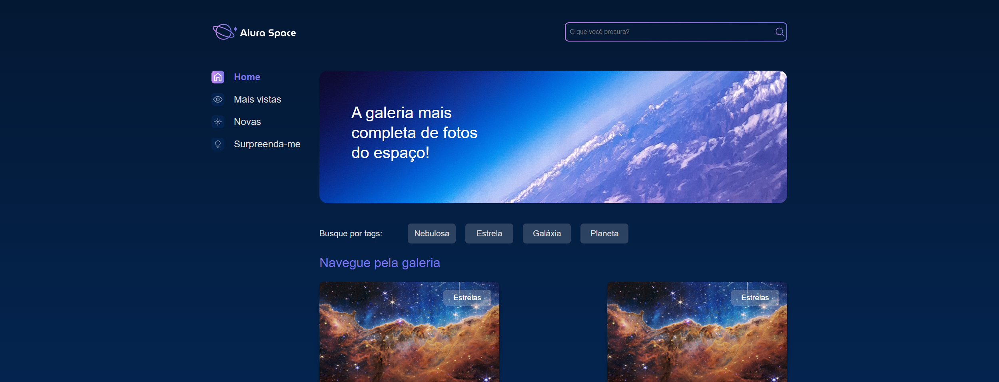

# Arquivos estáticos
***
## Carregando o template

#### Usando o template do projeto front-ending ['Alura Space'](https://github.com/alura-cursos/alura_space/tree/projeto_front), refatora-se o código HTML, ficando:

~~~html
<!DOCTYPE html>
<html lang="pt-br">

<head>
    <meta charset="UTF-8">
    <meta http-equiv="X-UA-Compatible" content="IE=edge">
    <meta name="viewport" content="width=device-width, initial-scale=1.0">
    <title>Alura Space</title>
    <link rel="preconnect" href="https://fonts.googleapis.com">
    <link rel="preconnect" href="https://fonts.gstatic.com" crossorigin>
    <link href="https://fonts.googleapis.com/css2?family=Poppins:wght@400;500;600&display=swap" rel="stylesheet">
    <link rel="stylesheet" href="/styles/style.css">
</head>

<body>
    

        <header class="cabecalho">
            
            

                

                    <input class="busca__input" type="text" placeholder="O que você procura?">
                    
                

            

        </header>
        <main class="principal">
            <section class="menu-lateral">
                <nav class="menu-lateral__navegacao">
                    <a href="#"> Home</a>
                    <a href="#"> Mais vistas</a>
                    <a href="#"> Novas</a>
                    <a href="#"> Surpreenda-me</a>
                </nav>
            </section>
            <section class="conteudo">
                <section class="banner">
                    
                    <h1 class="banner__titulo"> A galeria mais completa de fotos do espaço!</h1>
                </section>
                <section class="tags">
                    
Busque por tags:

                    <ul class="tags__lista">
                        <li class="tags__tag">Nebulosa</li>
                        <li class="tags__tag">Estrela</li>
                        <li class="tags__tag">Galáxia</li>
                        <li class="tags__tag">Planeta</li>
                    </ul>
                </section>
                <section class="galeria">
                    

                        <h2 class="cards__titulo">Navegue pela galeria</h2>
                        <ul class="cards__lista">
                            <li class="card">
                                <a href="imagem.html">
                                    
                                </a>
                                Estrelas
                                

                                    
Nome da foto

                                    

                                        
Fonte/fotógrafo/satélite

                                        
                                            
                                        
                                    

                                

                            </li>
                            <li class="card">
                                <a href="imagem.html">
                                    
                                </a>
                                Estrelas
                                

                                    
Nome da foto

                                    

                                        
Fonte/fotógrafo/satélite

                                        
                                            
                                        
                                    

                                

                            </li>
                            <li class="card">
                                <a href="imagem.html">
                                    
                                </a>
                                Estrelas
                                

                                    
Nome da foto

                                    

                                        
Fonte/fotógrafo/satélite

                                        
                                            
                                        
                                    

                                

                            </li>
                            <li class="card">
                                <a href="imagem.html">
                                    
                                </a>
                                Estrelas
                                

                                    
Nome da foto

                                    

                                        
Fonte/fotógrafo/satélite

                                        
                                            
                                        
                                    

                                

                            </li>
                            <li class="card">
                                <a href="imagem.html">
                                    
                                </a>
                                Estrelas
                                

                                    
Nome da foto

                                    

                                        
Fonte/fotógrafo/satélite

                                        
                                            
                                        
                                    

                                

                            </li>
                            <li class="card">
                                <a href="imagem.html">
                                    
                                </a>
                                Estrelas
                                

                                    
Nome da foto

                                    

                                        
Fonte/fotógrafo/satélite

                                        
                                            
                                        
                                    

                                

                            </li>
                        </ul>
                    

                </section>
            </section>
        </main>
    

    <footer class="rodape">
        

            
            
        

        
Desenvolvido por Alura

    </footer>
</body>

</html>
~~~

#### Outro refatoramento interessante fazer, para fins de organização, é criar outro diretório em 'templates', com o mesmo nome do app, 'galeria', para que assim, ao criar um HTML de outro app, reaproveitar o recurso, porém também será preciso refatorar os métodos que precisam receber o caminho dos templates, ficando:

***

## Arquivos estáticos

#### Para inserir os arquivos estáticos, conhecidos também por CSS, JS, imagens e outros no HTML, será preciso mostrar o caminho para uma pasta contendo todos esses arquivos, similarmente o que foi feito anteriormente, seguindo os passos para implementar o HTML.

#### Em '_setup/settings.py_', aproximadamente na linha 122, em baixo de '_STATIC_URL='static/'_', escreve-se uma variável que armazena o caminho da pasta que possui os arquivos estáticos, seguido de um novo diretório criado, dentro do setup:

#### Por fim, em baixo dessa variável, é implementado:
~~~python
STATICFILES_DIRS = [ #Variável responsável por mostrar em qual pasta está
    os.path.join(BASE_DIR, 'setup/static')
]

STATIC_ROOT = os.path.join(BASE_DIR, 'static') 
#Variável que cria e determina o caminho do novo diretório também chamado 'static', onde o Django possa coletar o conteúdo da pasta e implantar e manipular
~~~

#### Com o diretório criado, acessando [o Github do Alura Space](https://github.com/alura-cursos/alura_space/tree/projeto_front), baixando e exportando, colocam-se os arquivos estáticos 'assets' e 'styles' dentro de 'setup/static':

#### Agora, abrindo o terminal, para que o Django consiga de fato localizar a pasta, os arquivos e implementar, escreve-se:
~~~terminal
    python manage.py collectstatic
~~~

#### Para finalizar, no arquivo HTML, é possível e preciso, implementar código Python para seu funcionamento, dito isso, na primeira linha, antes do projeto, escreve-se '__', onde como o nome sugere, carrega os arquivos estáticos. Similarmente, no HTML, as tags que tiverem uma referência (href) a algum arquivo estático também vão precisar de auxílio do Python para funcionar:

###### Chamando CSS no HTML sem Python:
~~~html
    <link rel="stylesheet" href="/styles/style.css">
~~~

###### Chamando CSS no HTML com Python:
~~~html
    <link rel="stylesheet" href="">
~~~

#### Seguindo a lógica, o código HTML fica:

~~~html


<!DOCTYPE html>
<html lang="pt-br">

<head>
    <meta charset="UTF-8">
    <meta http-equiv="X-UA-Compatible" content="IE=edge">
    <meta name="viewport" content="width=device-width, initial-scale=1.0">
    <title>Alura Space</title>
    <link rel="preconnect" href="https://fonts.googleapis.com">
    <link rel="preconnect" href="https://fonts.gstatic.com" crossorigin>
    <link href="https://fonts.googleapis.com/css2?family=Poppins:wght@400;500;600&display=swap" rel="stylesheet">
    <link rel="stylesheet" href="">
</head>

<body>
    

        <header class="cabecalho">
            
            

                

                    <input class="busca__input" type="text" placeholder="O que você procura?">
                    
                

            

        </header>
        <main class="principal">
            <section class="menu-lateral">
                <nav class="menu-lateral__navegacao">
                    <a href="#"> Home</a>
                    <a href="#"> Mais vistas</a>
                    <a href="#"> Novas</a>
                    <a href="#"> Surpreenda-me</a>
                </nav>
            </section>
            <section class="conteudo">
                <section class="banner">
                    
                    <h1 class="banner__titulo"> A galeria mais completa de fotos do espaço!</h1>
                </section>
                <section class="tags">
                    
Busque por tags:

                    <ul class="tags__lista">
                        <li class="tags__tag">Nebulosa</li>
                        <li class="tags__tag">Estrela</li>
                        <li class="tags__tag">Galáxia</li>
                        <li class="tags__tag">Planeta</li>
                    </ul>
                </section>
                <section class="galeria">
                    

                        <h2 class="cards__titulo">Navegue pela galeria</h2>
                        <ul class="cards__lista">
                            <li class="card">
                                <a href="imagem.html">
                                    
                                </a>
                                Estrelas
                                

                                    
Nome da foto

                                    

                                        
Fonte/fotógrafo/satélite

                                        
                                            
                                        
                                    

                                

                            </li>
                            <li class="card">
                                <a href="imagem.html">
                                    
                                </a>
                                Estrelas
                                

                                    
Nome da foto

                                    

                                        
Fonte/fotógrafo/satélite

                                        
                                            
                                        
                                    

                                

                            </li>
                            <li class="card">
                                <a href="imagem.html">
                                    
                                </a>
                                Estrelas
                                

                                    
Nome da foto

                                    

                                        
Fonte/fotógrafo/satélite

                                        
                                            
                                        
                                    

                                

                            </li>
                            <li class="card">
                                <a href="imagem.html">
                                    
                                </a>
                                Estrelas
                                

                                    
Nome da foto

                                    

                                        
Fonte/fotógrafo/satélite

                                        
                                            
                                        
                                    

                                

                            </li>
                            <li class="card">
                                <a href="imagem.html">
                                    
                                </a>
                                Estrelas
                                

                                    
Nome da foto

                                    

                                        
Fonte/fotógrafo/satélite

                                        
                                            
                                        
                                    

                                

                            </li>
                            <li class="card">
                                <a href="imagem.html">
                                    
                                </a>
                                Estrelas
                                

                                    
Nome da foto

                                    

                                        
Fonte/fotógrafo/satélite

                                        
                                            
                                        
                                    

                                

                            </li>
                        </ul>
                    

                </section>
            </section>
        </main>
    

    <footer class="rodape">
        

            
            
        

        
Desenvolvido por Alura

    </footer>
</body>

</html>
~~~

## Antes do load static:

## Depois do load static:

***

## Outras páginas

#### No index, há elementos onde, ao clicar, redireciona para outra página, e para fazer isso, basta copiar o arquivo [imagem.html](https://github.com/alura-cursos/alura_space/tree/projeto_front/imagem.html), e colar dentro do deiretório '_templates/galeria_'

###### templates/galeria/imagem.html
~~~html
<!DOCTYPE html>
<html lang="pt-br">

<head>
    <meta charset="UTF-8">
    <meta http-equiv="X-UA-Compatible" content="IE=edge">
    <meta name="viewport" content="width=device-width, initial-scale=1.0">
    <title>Alura Space</title>
    <link rel="preconnect" href="https://fonts.googleapis.com">
    <link rel="preconnect" href="https://fonts.gstatic.com" crossorigin>
    <link href="https://fonts.googleapis.com/css2?family=Space+Grotesk:wght@400;500;600&display=swap" rel="stylesheet">
    <link rel="stylesheet" href="styles/style.css">

</head>

<body>
    

        <header class="cabecalho">
            
            

                

                    <input class="busca__input" type="text" placeholder="O que você procura?">
                    
                

            

        </header>
        <main class="principal">
            <section class="menu-lateral">
                <nav class="menu-lateral__navegacao">
                    <a href="index.html"> Home</a>
                    <a href="#"> Mais vistas</a>
                    <a href="#"> Novas</a>
                    <a href="#"> Surpreenda-me</a>
                </nav>
            </section>
            <section class="conteudo">
                <section class="imagem">
                    

                        
                        

                            

                                
“Penhascos Cósmicos” na Nebulosa Carina

                                
12 de julho de 2022

                                
O que se parece muito com montanhas escarpadas em uma noite enluarada é na verdade a borda de uma região jovem e próxima de formação de estrelas NGC 3324 na Nebulosa Carina. Capturada em luz infravermelha pela Near-Infrared Camera ( NIRCam ) no Telescópio Espacial James Webb da NASA, esta imagem revela áreas anteriormente obscurecidas do nascimento de estrelas.

                            

                        

                    

                </section>
            </section>
        </main>
    

    <footer class="rodape">
        

            
            
        

        
Desenvolvido por Alura

    </footer>
</body>

</html>
~~~

#### Em seguida, declara-se uma nova função em '_galeria/views.py_':

###### galeria/views.py
~~~python
from django.shortcuts import render

def index(request):
    return render(request, 'galeria/index.html')

def imagem(request):
    return render(request, 'galeria/imagem.html')
~~~

#### Por fim, em '_galeria/urls.py_', é declarado a URL que leva à função:

###### galeria/urls.py
~~~python
from django.urls import path
from galeria.views import * #De views, em galeria, importar todos os métodos

urlpatterns = [
    path('', index),
    path('imagem/', imagem),
]
~~~

#### Apesar de funcionar, ao clicar nos elementos do index, o usuário na verdade, é redirecionado para uma URL 'imagem.html'. 
#### Isso acontece porque, aproximadamente, na linha 56 do 'index.html', há uma referência que por acaso possui o nome do URL ao clicar na imagem. Para solucionar esse erro de uma forma, é dentro de '_galeria/urls.py_', adicionar um _namespace_, que é uma referência que pode ser usado para lidar com esse caso, especificamene, dito isso, o código fica:

###### galeria/urls.py
~~~python
from django.urls import path
from galeria.views import * #De views, em galeria, importar todos os métodos

urlpatterns = [
    path('', index),
    path('imagem/', imagem, name="imagem"),
]
~~~

#### e na linha 56, dentro do HTML, troca-se a referência por código Python, com o nome sendo o mesmo do namespace, ficando:

~~~html
<a href="">
~~~

#### Pra finalizar, carrega-se todos os arquivos estáticos do arquivo galeria.html, e as referências as imagens, ficando:

###### index.html
~~~html


<!DOCTYPE html>
<html lang="pt-br">

<head>
    <meta charset="UTF-8">
    <meta http-equiv="X-UA-Compatible" content="IE=edge">
    <meta name="viewport" content="width=device-width, initial-scale=1.0">
    <title>Alura Space</title>
    <link rel="preconnect" href="https://fonts.googleapis.com">
    <link rel="preconnect" href="https://fonts.gstatic.com" crossorigin>
    <link href="https://fonts.googleapis.com/css2?family=Poppins:wght@400;500;600&display=swap" rel="stylesheet">
    <link rel="stylesheet" href="">
</head>

<body>
    

        <header class="cabecalho">
            
            

                

                    <input class="busca__input" type="text" placeholder="O que você procura?">
                    
                

            

        </header>
        <main class="principal">
            <section class="menu-lateral">
                <nav class="menu-lateral__navegacao">
                    <a href=""> Home</a>
                    <a href="#"> Mais vistas</a>
                    <a href="#"> Novas</a>
                    <a href="#"> Surpreenda-me</a>
                </nav>
            </section>
            <section class="conteudo">
                <section class="banner">
                    
                    <h1 class="banner__titulo"> A galeria mais completa de fotos do espaço!</h1>
                </section>
                <section class="tags">
                    
Busque por tags:

                    <ul class="tags__lista">
                        <li class="tags__tag">Nebulosa</li>
                        <li class="tags__tag">Estrela</li>
                        <li class="tags__tag">Galáxia</li>
                        <li class="tags__tag">Planeta</li>
                    </ul>
                </section>
                <section class="galeria">
                    

                        <h2 class="cards__titulo">Navegue pela galeria</h2>
                        <ul class="cards__lista">
                            <li class="card">
                                <a href="">
                                    
                                </a>
                                Estrelas
                                

                                    
Nome da foto

                                    

                                        
Fonte/fotógrafo/satélite

                                        
                                            
                                        
                                    

                                

                            </li>
                            <li class="card">
                                <a href="">
                                    
                                </a>
                                Estrelas
                                

                                    
Nome da foto

                                    

                                        
Fonte/fotógrafo/satélite

                                        
                                            
                                        
                                    

                                

                            </li>
                            <li class="card">
                                <a href="">
                                    
                                </a>
                                Estrelas
                                

                                    
Nome da foto

                                    

                                        
Fonte/fotógrafo/satélite

                                        
                                            
                                        
                                    

                                

                            </li>
                            <li class="card">
                                <a href="">
                                    
                                </a>
                                Estrelas
                                

                                    
Nome da foto

                                    

                                        
Fonte/fotógrafo/satélite

                                        
                                            
                                        
                                    

                                

                            </li>
                            <li class="card">
                                <a href="">
                                    
                                </a>
                                Estrelas
                                

                                    
Nome da foto

                                    

                                        
Fonte/fotógrafo/satélite

                                        
                                            
                                        
                                    

                                

                            </li>
                            <li class="card">
                                <a href="">
                                    
                                </a>
                                Estrelas
                                

                                    
Nome da foto

                                    

                                        
Fonte/fotógrafo/satélite

                                        
                                            
                                        
                                    

                                

                            </li>
                        </ul>
                    

                </section>
            </section>
        </main>
    

    <footer class="rodape">
        

            
            
        

        
Desenvolvido por Alura

    </footer>
</body>

</html>
~~~

###### imagem.html
~~~html


<!DOCTYPE html>
<html lang="pt-br">

<head>
    <meta charset="UTF-8">
    <meta http-equiv="X-UA-Compatible" content="IE=edge">
    <meta name="viewport" content="width=device-width, initial-scale=1.0">
    <title>Alura Space</title>
    <link rel="preconnect" href="https://fonts.googleapis.com">
    <link rel="preconnect" href="https://fonts.gstatic.com" crossorigin>
    <link href="https://fonts.googleapis.com/css2?family=Space+Grotesk:wght@400;500;600&display=swap" rel="stylesheet">
    <link rel="stylesheet" href="">

</head>

<body>
    

        <header class="cabecalho">
            
            

                

                    <input class="busca__input" type="text" placeholder="O que você procura?">
                    
                

            

        </header>
        <main class="principal">
            <section class="menu-lateral">
                <nav class="menu-lateral__navegacao">
                    <a href=""> Home</a>
                    <a href="#"> Mais vistas</a>
                    <a href="#"> Novas</a>
                    <a href="#"> Surpreenda-me</a>
                </nav>
            </section>
            <section class="conteudo">
                <section class="imagem">
                    

                        
                        

                            

                                
“Penhascos Cósmicos” na Nebulosa Carina

                                
12 de julho de 2022

                                
O que se parece muito com montanhas escarpadas em uma noite enluarada é na verdade a borda de uma região jovem e próxima de formação de estrelas NGC 3324 na Nebulosa Carina. Capturada em luz infravermelha pela Near-Infrared Camera ( NIRCam ) no Telescópio Espacial James Webb da NASA, esta imagem revela áreas anteriormente obscurecidas do nascimento de estrelas.

                            

                        

                    

                </section>
            </section>
        </main>
    

    <footer class="rodape">
        

            
            
        

        
Desenvolvido por Alura

    </footer>
</body>

</html>
~~~

***
## [Resolução da parte 3](https://github.com/ArthurOReis/Django-parte_2_e_3)